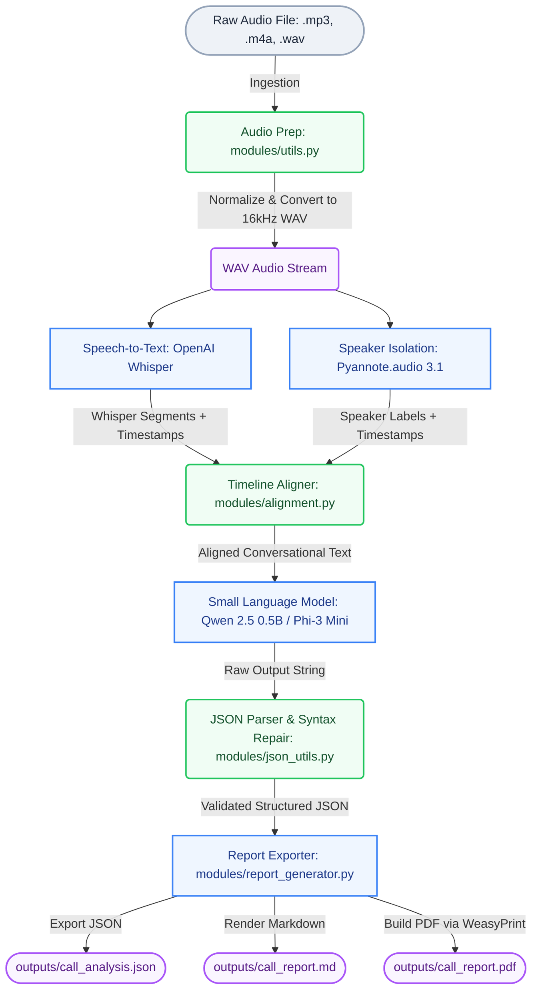

# 🎙️ VoxPulse: SLM Selection & System Architecture Justification

This document details the architectural decisions behind **VoxPulse**—specifically the selection of our Small Language Model (SLM) for call quality assurance (QA) evaluation—and outlines our end-to-end data pipeline.

---

## 🏗️ System Architecture Diagram

VoxPulse utilizes a modular, sequential processing pipeline to transform raw audio into rich, structured compliance reports. Below is the system flow from ingestion to export:

---

## 🧠 Why We Chose Our SLM Over Alternatives

Evaluating call transcripts requires high-level linguistic comprehension, semantic reasoning, strict rule compliance, and **structured JSON formatting**. Historically, developers relied on large cloud APIs (like OpenAI's GPT-4o-mini or Claude 3.5 Haiku). 

VoxPulse breaks this paradigm by employing **Qwen2.5-0.5B-Instruct** (with optional support for **Phi-3-Mini-4k-Instruct**) running fully locally. Below is our justification for this choice over alternatives:

### 1. Zero-Cost, On-Premises Privacy & Compliance
Customer support call recordings frequently contain highly sensitive information (e.g., credit card numbers, billing addresses, medical details, full names).
* **The API Alternative:** Sending this data to third-party endpoints creates compliance risks under GDPR, HIPAA, and PCI-DSS.
* **Our SLM Approach:** Running the model entirely inside the user’s local workstation or internal secure environment eliminates data transmission. 

### 2. High-Fidelity JSON Generation & Instruction Adherence
Smaller models are historically notorious for failing to output valid JSON consistently, often outputting markdown wrappers, pleasantries, or corrupted syntax.
* **Why Qwen2.5 / Phi-3:** Qwen2.5-0.5B and Phi-3-Mini are heavily optimized through Supervised Fine-Tuning (SFT) and Reinforcement Learning from Human Feedback (RLHF) on chat instructions. Under our rigorous system prompt, they adhere exactly to the required JSON schema, while our custom `json_utils.py` regex-based syntax repair acts as an air-tight fallback.

### 3. Extreme Computational Efficiency & Consumer HW Friendly
* **CPU and Apple Silicon Friendly:** Qwen2.5-0.5B requires **less than 1.2 GB of RAM** in standard float16 precision. This allows developers to run transcription (Whisper), speaker isolation (Pyannote), and evaluation (SLM) together on standard consumer laptops without crashing due to out-of-memory errors.
* **Low Latency:** Processing a single call takes only a few seconds on CPU/M-series chips, contrasting sharply with 7B+ parameter models which require dedicated GPUs to achieve acceptable speeds.

---

## 📊 Comparative Analysis

The table below contrasts our selected models against prominent alternatives across key dimensions:

| Dimension | **Qwen2.5-0.5B-Instruct** (Selected Default) | **Phi-3-Mini-4k-Instruct** (Selected Alternate) | **Llama-3.2-3B-Instruct** | **Proprietary Cloud APIs** (GPT-4o-mini) |
|---|---|---|---|---|
| **Deployability** | 🟢 Local (Extreme low resource) | 🟢 Local (Low-to-mid resource) | 🟡 Local (Requires standard GPU/VRAM) | 🔴 External Cloud Only |
| **VRAM Footprint** | **~1.0 GB** | **~7.6 GB** | **~6.2 GB** | **Zero VRAM** (Paid Cloud API) |
| **Compliance Risk**| 🟢 Zero (No external data transit) | 🟢 Zero (No external data transit) | 🟢 Zero (No external data transit) | 🔴 High (PCI, GDPR, HIPAA risks) |
| **JSON Adherence**| 🟢 Excellent (Clean, parser-ready) | 🟢 Excellent | 🟡 Moderate (Occasional wrapper bugs) | 🟢 Perfect (Supports structured outputs) |
| **Operational Cost**| 🟢 **Free ($0)** | 🟢 **Free ($0)** | 🟢 **Free ($0)** | 🔴 Paid per token (Unpredictable) |
| **CPU Speed** | 🟢 Extremely Fast (~30 tok/s) | 🟡 Moderate (~5-10 tok/s) | 🔴 Slow on standard CPU | N/A (API bound) |

---

## 🎯 Conclusion

By choosing a highly compressed yet robust instruct-tuned SLM (Qwen2.5-0.5B / Phi-3-Mini), **VoxPulse achieves the optimal intersection of data privacy, zero API costs, high execution speed, and rigorous structured data output.** This architecture proves that enterprise-grade automated QA call center analysis is entirely viable on local consumer-grade hardware.
